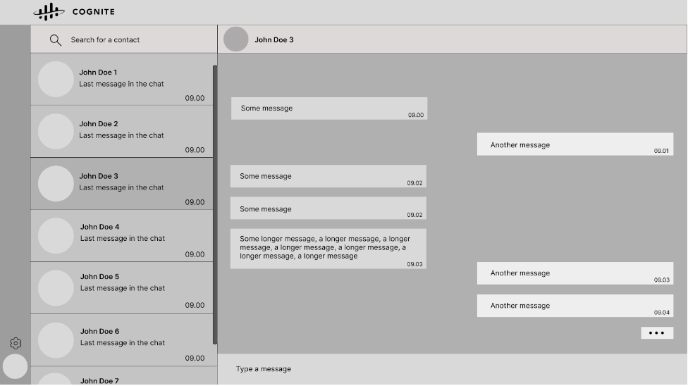

# Cognite Chat

## Description
A simple React-based chat application designed to satisfy the following requirements:

#### Goals:
1. The user should be able to write messages in the chat window and see them appear.
2. The user should be able to select a friend and see his chat with this friend.

#### Non-goals:
1. Persisting chat history.
2. Talking to a backend.
3. Multiple users.

Tailwind CSS was used for styling.

## Quick start
Clone the repository

	git clone https://github.com/bites2bytes/cognite-chat-app

Install dependencies

	npm i

Start the application

	npm start

Open the application on [http://localhost:3000](http://localhost:3000)

## Deploying to GitHub Pages

This section will provide guidance for building and deploying Cognite Chat.

### Steps for deployment

#### 1. Ensure all changes are on the master branch:
- Make sure your local master branch is up-to-date with the remote one.

#### 2. Build the application
- With the local master branch up-to-date, run `npm run build` to start the build process. This command compiles the application and prepares it for deployment.

#### 3. Deploy the application:
- After the build process completes, the application can be deployed by running `npm run deploy`. This command pushes the built application to `gh-pages`.

#### 4. Accessing the deployed application:
- Once the deployment process is complete, the Cognite Chat will be available at [https://bites2bytes.github.io/cognite-chat-app/](https://bites2bytes.github.io/cognite-chat-app/)

**Note:** The URL above was marked as dangerous by Google Chrome. It seems that this is a common issue when deploying with GitHub Pages. I am currently trying to solve the problem and get the page reviewed and marked as saved. For now, please open with caution.


## How to chat

You can have an interactive chat experience in two ways:
1) You can use some of these keywords in your messages:
		```"Hello", "Hi", "Hey", "How are you?", "How are you doing?", "How do you do today?"```

2) You can ask specific questions and learn more about Cognite. Please use the questions from the following list:
- What is the main idea that Cognite was founded on?
- Why is generative AI important in delivering business impact?
- How is Cognite enabling data democratization?
- Why is context crucial for generative AI?
- What is contextualization?
- What is the generative AI problem?
- What is the industrial AI problem?
- Why contextualization matters when it comes to training LLMs?
- Which are the five types of contextualization?
- What is entity matching?
- What are the different options for entity matching?

## Data

The data consists of two main tables, 'users' and 'chats', each designed to capture the needed interactions. You can see the data structures in the following tables:


### Data storage

The chat data was initially stored locally in the repository within data.js and scripts.js. However, the data has now been moved to GitHub gists, which, in this case, serves as an endpoint from which we can retrieve the data in a JSON format. You can find the data on the following links: [chatData]((https://gist.githubusercontent.com/bites2bytes/20b97cdb45c73a0430d48a021e36cf6e/raw/c8668c6eac0b0ef4ff453a985eb4f7f92dff27d3/chatData.json)) and [chatScripts](https://gist.githubusercontent.com/bites2bytes/1c5494766a71dd23abae8f979a0e851c/raw/5b1f4a533dd0f6147393b34b7b3a9db119857567/chatScripts.json)

#### Note: All the data used in the datasets is publicly available.


## Initial development plan

The development plan was structured in several stages:

### Layout and structure
Which elements are needed?
How should they be structured?
How are they connected?

- *Header:* displaying Cognite's logo
- *Contact List:* displaying a list of contacts
- *Contact Card:* displaying contact details (name, surname, last sent message, timestamp)
- *Chat Window Header:* displaying current selected contact's avatar
- *Chat Window Body:* displaying messages between the logged user and selected contact
- *Message Card (Blob):* Contains message details (Text, timestamp)
- *Chat Type Field:* typing and sending new messages
- *Sidebar:* has the logged user's avatar, plus can contain functionalities like settings, profile details, etc

### Design and UI
What colors should be used?
Is it a UI library?
Should pure CSS, SCSS, or Tailwind CSS be used?

Here is the basic prototype created in Figma:



##### Note: This is the initial design and has since been slightly changed and updated


### UI Development

Building up the UI by creating all the components needed and populating them with hardcoded data.
- creating a responsive design
- adding subtle touches like shadows, hover and click effects, updating scroll design, etc

### Fulfill basic requirements

Creating basic datasets and state management strategy, as well as adding logic for the two main functionalities:
- Enabling a new message blob to appear when a user sends a message;
- Filling up the contact list with the logged user's contacts
- Displaying the chat messages with the selected contact

### Create a better User Experience

Adding utility functions for better user experience: formatting timestamps, adding the last sent message in the user card, scrolling to the bottom of the chat window when a new message appears, adding unique colors to user's avatars, moving contacts with whom we last chatted to the top, etc

Moving datasets to a GitHub gist

Creating a chat mimic mechanism, so when a user writes a message, there is an automated response with a small delay; Each response is tailored to the last sent message, using predefined scripts.


