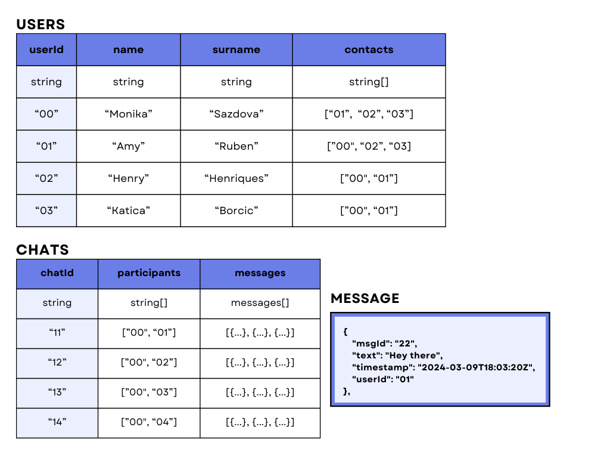

# Cognite Chat

## Description
A simple React-based chat application designed to satisfy the following requirements:

#### Goals:
1. The user should be able to write messages in the chat window and see them appear.
2. The user should be able to select a friend and see his chat with this friend.

#### Non-goals:
1. Persisting chat history.
2. Talking to a backend.
3. Multiple users.

Tailwind CSS was used for styling.

## Quick start
Clone the repository

	git clone https://github.com/bites2bytes/cognite-chat-app

Install dependencies

	npm i

Start the application

	npm start

Open the application on [http://localhost:3000](http://localhost:3000)

## Deploying to GitHub Pages

This section will provide guidance for building and deploying Cognite Chat.

### Steps for deployment

#### 1. Ensure all changes are on the master branch:
- If the local changes are already commited to the master branch, they need to be pushed to the remote repository.
- If the changes are on a separate branch 'branch-name', a PR from 'branch-name' to master should be opened and merged.
- After merging, make sure your local master branch is up-to-date with the remote one.

#### 2. Build the application
- With the local master branch up-to-date, run `npm run build` to start the build process. This command compiles the application and prepares it for deployment.

#### 3. Deploy the application:
- After the build process completes, the application can be deployed by running `npm run deploy`. This command pushes the built application to `gh-pages`.

#### 4. Accessing the deployed application:
- Once the deployment process is complete, the Cognite Chat will be available at: [https://bites2bytes.github.io/cognite-chat-app/](https://bites2bytes.github.io/cognite-chat-app/)

**Note:** The url above was marked as dangerous by Google Chrome. It seems that this is a common issue when deploying with GitHub Pages. I am currently trying to solve the problem and get the page reviewd and marked as save. For now, please open with caution.

## Data

The data used consists of two main tables, 'users' and 'chats', each designed to capture the needed interactions. You can see the data structures in the following tables:

### Data storage

Initially, the chat data was stored locally in the repository within data.js. However, the data has now been moved to a [GitHub gist](https://gist.githubusercontent.com/bites2bytes/20b97cdb45c73a0430d48a021e36cf6e/raw/855c9bc0c767583130b2910f6b51d8a292b09135/chatData.json) which, in this case, serves as an endpoint from which we can retrieve the data in a JSON format (read-only API).

#### Note: All the data used in the datasets is publicly available.